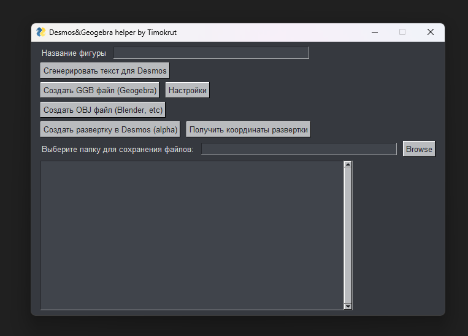

# Math

Инструкция

Шаг первый: Открыть сайт http://dmccooey.com/polyhedra

Шаг второй: Написать название фигуры (Без пробелов!)
(Лучше всего взять из поисковой строки например: http://dmccooey.com/polyhedra/GeodesicCube15.html -> отсюда берем GeodesicCube15)
(CTRL + V может не работать на русской раскладке)

Шаг третий: Выбрать путь для сохранения файлов

Далее есть три варианта:

Первый - Сгенерировать текст для Desmos: 
1) Открыть https://www.desmos.com/3d
2) Вставить параметры, которые программа скопировала в буфер (CTRL + V)

Второй - Создать GGB файл (Geogebra)
1) Открыть https://www.geogebra.org/3d
2) На сайте нажать на иконку меню, а затем нажать на Open и выбрать поиск файла на локальном хранилище

3) Найти папку, которую вы выбрали, и выбрать файл с расширением **название_фигуры**.ggb

4) !Дополнительно

Вкладка "Настройки"
 

Здесь можно настроить характеристики для .ggb файла

Polygon - настройка поверхности
R, G, B - настройка цвета
Alpha - настройка прозрачности
Label - подпись названия поверхности

Segment - настройка ребер
R, G, B - настройка цвета
Alpha - настройка прозрачности
Thickness - настройка толщины ребра
Show object - настройка скрытия ребра 
Label - подпись названия ребра

Point - настройка точки
R, G, B - настройка цвета
Alpha - настройка прозрачности
PointSize - настройка величины ребра
Label - подпись названия точки

Третий - Создать OBJ файл
1) В выбранной папке создается еще одна папка с названием obj
2) В этой папке будет создан файл **название_фигуры**.obj, который можно открыть в любой программе поддерживающей данный тип файла, например Blender

Пример GeodesicCube15 в программе Blender

