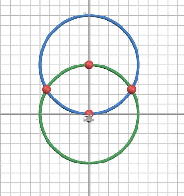

# Алгоритм

Алгоритм работает с гранями многогранника, разбитыми на треугольники. Треугольники описываются вершинами, из которых они состоят. Вершины первой грани многогранника запоминаются.

Взяв за основу первый треугольник из первой грани, на плоскости строятся все остальные вершины. Сначала на плоскости откладывается первый треугольник: первая вершина в начале координат, вторая вершина лежит на оси Y, третья вершина получается решением системы уравнений двух окружностей.

Все остальные вершины получаются через решение системы уравнений.

Система уравнений окружностей имеет два решения. Выбирается решение, которое прошло все проверки. В случае первой грани выбирается решение с отрицательным знаком

Выбор следующей вершины определяется с помощью нахождения граней, которые отличаются от текущей на одну вершину. 
На плоскости могут откладыватся несколько точек, которые при склейке образуют одну единственную точку. Чтобы не было отложено лишних точек, существует соответствие отложенной на плоскости точке с гранью, из которой она была отложена (т.е. с одной грани нельзя несколько раз отложить одну и ту же точку).

Также проверяется наличие точки в списке точек (нет дубликатов).

В случае, если система уравнений двух окружностей не имеет решений, функция вычисления решения вернет комплексное число. Они отметаются.
Предполагается, что точки из первой грани не могут повторятся. Все такие повторения отметаются.

Алгоритм продолжает откладывать точки, пока не пройдет все грани (разбитые на треугольники).

Если нужно добавить точку, которая образуется из вершин, которые повторяются на плоскости, рассматриваются все комбинации повторяющихся точек, пока не найдется первая подходящая.

Результатом алгоритма является списком точек на плоскости.

# Функции

Функция distance вычисляет расстояние между двумя точками.

Функция count_solution решает систему уравнений двух окружностей на плоскости.

Функция find_sim сравнивает две грани, и возвращает число совпадений.

Функция point_max_comp находит похожие грани с исходной (отличаются на одну вершину) и возвращает два списка: в первом списке те вершины, которые нужно отложить; во втором же те вершины, которые надо использовать при откладывании вершин из первого списка.

Функция check_solution проверяет решения.

Основная программа проходит через все грани, используя вышеописанные функции.